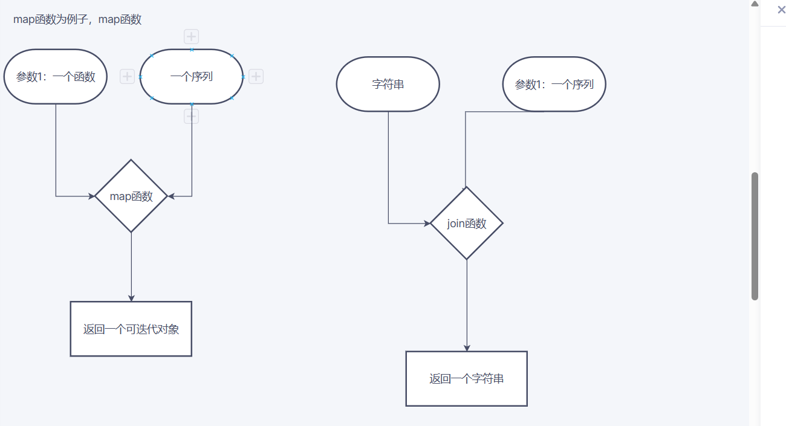
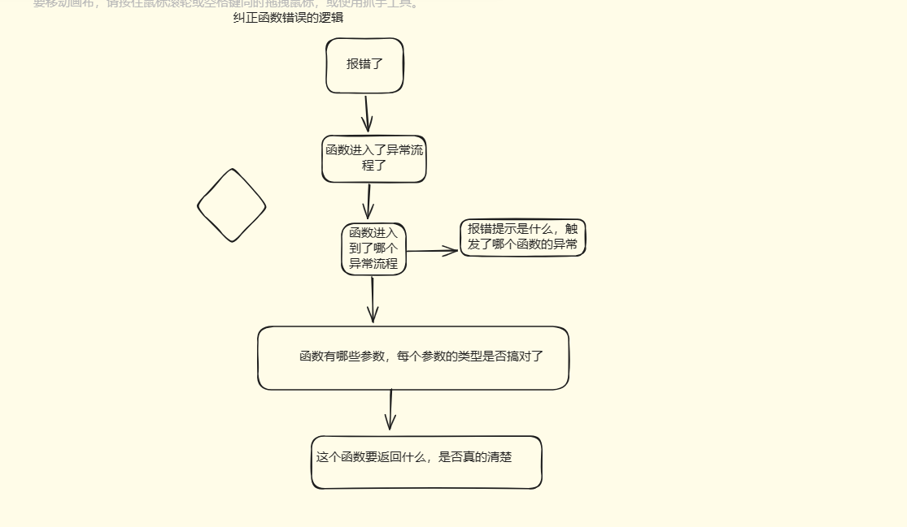

#在这个算法里学到的知识：

#map函数相关
##返回值的形式要搞对，不要想当然
1.map函数的用法，python里面的map函数，python3的返回值不是列表，是可迭代对象，所以不能直接和列表一样去使用的
##参数的顺序要搞对，别搞反了
2.map函数有2个参数，第一个参数是函数，第二个参数是序列，顺序要搞对
##使用函数时，函数的名称要写对，不要写错了名字，如果没有代码检查，这种问题很耗时
3.如果比较简单的话，可以直接将lambda函数作为参数，传递给map函数使用，lambda函数中间有的b单不发音，拼写的时候要拼写正确了。

#join函数相关
##序列中元素的数据类型要搞对
4.join函数参数中的序列的单个元素不能为整数，否则join会报错
5.join函数的用法 str.join(sequence), str可以为空。

#遍历列表
##要分清楚自己是直接遍历的数组，还是遍历数组的长度
6.如果是按照数组的长度遍历数组，要记得从数组中取下标，来拿数组中的元素，比如arr[i],不要直接把i给传到后续的程序

#函数学习的总结

基于此，我们要明白一个道理，学习函数，要想学好的话，就要学习好这门编程语言的基本的数据类型才行，
因为我们不管具体的参数名称你是怎么定义的，名字形象生动，能描述你开发的函数作用就行，能代表你的参数的意义，但是这个数据结构是关键啊，很多问题就发生在这个数据结构上，我认为，要搞清楚一个函数的返回值是什么数据类型，是字符串，列表，元组还是字典，还是可迭代对象，还是整型，不同的数据类型，表示这个返回值在后续能进行什么操作，能够被哪些函数利用，比如返回值是字符串，那么你的字符串，就可以切片啊，遍历啊，这些操作，如果是字典啊这类数据结构，你就得用字典的方法去处理这个数据，

#容易出错的场景：
返回值是一个可迭代对象，但不是列表，如果想变成列表，需要使用list函数进行转换一下，但是自己就直接用列表的方法去操作这个可迭代对象了，这就会报错了

#入参的重要性

函数的入参，是函数处理逻辑的开始部分，如果给的入参不满足函数的要求，那么你怎么给他处理呢，比如说函数内部，对你的入参，进行一个校验，发现没通过，是在他的异常逻辑里面，或者直接给你捕获了，那你还能有什么返回值呢？

当然如果你的入参，确实是在异常范围内的正常产生的，那还好说，如果说，是你处理逻辑错误，导致上一步生成的结果，变的异常，然后传入到函数中，那么久需要纠正上一步的逻辑了。

#纠错流程初步总结

